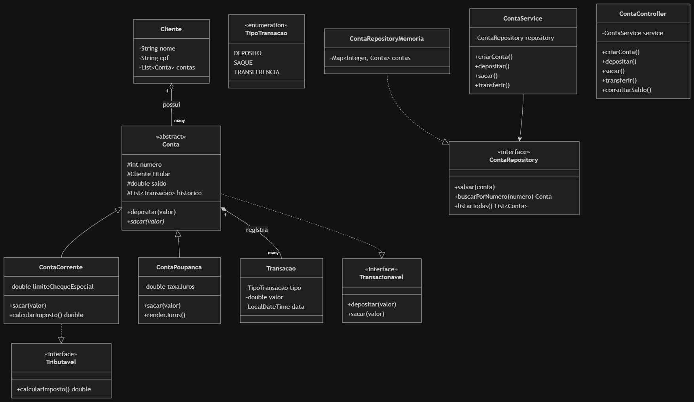

# Documentação — Sistema Bancário (POO)

Documento vivo: vai sendo preenchido conforme cada etapa do [CHECKLIST.md](CHECKLIST.md) é fechada.

## 1. Requisitos

### 1.1 Funcionalidades básicas
- Criar conta
- Depósito
- Saque
- Transferência
- Consulta de saldo / extrato

### 1.2 Regras de negócio
- Tipos de conta: **Corrente** e **Poupança** (herança a partir de `Conta` abstrata)
- Conta Corrente: pode ficar negativa até um limite de cheque especial
- Conta Poupança: não pode ficar negativa; possui método `renderJuros()` (rendimento manual, simulando fechamento do mês)
- Conta Corrente implementa a interface `Tributavel` (taxa/imposto sobre o saldo); Poupança não implementa

### 1.3 Requisitos não-funcionais
- Persistência: **em memória** (sem banco de dados nem arquivo)
- Interface: **web**, servida por uma API Java com **Spring Boot**, consumida por uma página HTML/CSS/JS
- Linguagem/stack: **Java 21 (LTS)**, **Maven**, **Spring Boot 3.x**
- POO (modelagem das classes) e a camada web serão planejadas juntas desde o início

## 2. Modelagem

### 2.1 Arquitetura em camadas

Padrão Spring Boot: **Controller → Service → Repository**.

- `ContaController` — recebe as requisições HTTP (criar conta, depósito, saque, transferência, extrato)
- `ContaService` — regra de negócio (valida operações, orquestra transferências entre contas)
- `ContaRepository` (interface) + `ContaRepositoryMemoria` (implementação com `Map`) — armazenamento em memória, abstraído por interface para facilitar troca futura por banco de dados

### 2.2 Entidades

- **Cliente** — nome, cpf, lista de contas (composição)
- **Conta** (abstrata) — numero, titular, saldo, histórico de transações
  - **ContaCorrente** — + limite de cheque especial, implementa `Tributavel`
  - **ContaPoupanca** — + taxa de juros, método `renderJuros()`
- **Transacao** — tipo, valor, data
- **TipoTransacao** (enum) — DEPOSITO, SAQUE, TRANSFERENCIA

Cliente é criado junto com a conta (sem CRUD próprio).

### 2.3 Relacionamentos

- Cliente **possui** (1‑N) Conta — composição
- Conta **registra** (1‑N) Transacao — composição
- ContaCorrente e ContaPoupanca **herdam** de Conta
- Conta implementa `Transacionavel`; ContaCorrente também implementa `Tributavel`
- ContaRepositoryMemoria implementa `ContaRepository`
- ContaService depende de `ContaRepository` (não da implementação concreta)
- ContaController depende de ContaService

### 2.4 Diagrama de classes



Fonte editável: [`docs/Sistema-bancário.drawio`](docs/Sistema-bancário.drawio) (abrir em [app.diagrams.net](https://app.diagrams.net) ou na extensão draw.io do VS Code)

### 2.5 Hierarquias e interfaces

- **Herança:** `Conta` (abstrata) → `ContaCorrente`, `ContaPoupanca`
- **Interfaces:** `Transacionavel` (toda conta), `Tributavel` (só ContaCorrente), `ContaRepository` (abstrai armazenamento)
- **Polimorfismo:** `sacar()` se comporta diferente em cada subclasse; o Service trata todas as contas como `Conta`, sem saber o tipo concreto

## 3. Setup do ambiente

- Projeto gerado via [Spring Initializr](https://start.spring.io): Maven, Java 21, Group `com.raylan`, Artifact `sistemabancario`
- Dependências: Spring Web, Spring Boot DevTools, Validation
- Controle de versão: já existente (repositório git da pasta `portfolio-projects`)
- Porta da aplicação alterada para **8081** em `application.properties` (`server.port=8081`), pois a porta 8080 já é usada por um proxy residual do Docker Desktop/WSL2 (sem container publicado nela — não valia mexer no Docker)
- Validado com `./mvnw spring-boot:run`: aplicação sobe corretamente ("Started SistemabancarioApplication" na porta 8081)

## 4. Implementação
_(registro das classes conforme vão sendo criadas)_

- [x] `Cliente` — POJO com composição de contas
- [x] `TipoTransacao` (enum), `Transacao`
- [x] `SaldoInsuficienteException` (checked), `ContaInvalidaException` (unchecked)
- [x] `Transacionavel` (interface), `Conta` (abstrata)
- [x] `Tributavel` (interface), `ContaCorrente`
- [x] `ContaPoupanca`
- [x] Modelo validado por testes de unidade (`ContaTest`) — polimorfismo, cheque especial e restrição de saldo negativo confirmados
- [x] `ContaRepository` (interface) + `ContaRepositoryMemoria` (`@Repository`, armazenamento em `ConcurrentHashMap`)
- [x] `ContaService` (`@Service`, injeção via construtor do `ContaRepository`) — validado por testes (`ContaServiceTest`): criação de conta, transferência entre contas e falha por saldo insuficiente sem perda de dinheiro
- [x] `ContaController` (`@RestController`) + DTOs (`CriarContaRequest`, `ValorRequest`, `TransferenciaRequest`, `ContaResponse`, `TransacaoResponse`) — DTOs evitam expor as entidades de domínio direto na API (Conta ↔ Cliente têm referência circular) e desacoplam a API do modelo interno
- [x] `ContaResponse` inclui o histórico de transações (`List<TransacaoResponse>`), fechando o requisito original de extrato
- [x] `ApiExceptionHandler` (`@RestControllerAdvice`) — mapeia `SaldoInsuficienteException` para HTTP 422 e `ContaInvalidaException` para HTTP 404

## 5. Testes

- `ContaTest` (unitário) — polimorfismo no `sacar()`, cheque especial da corrente, restrição de saldo negativo da poupança
- `ContaServiceTest` (integração, sem contexto Spring) — criação de conta, transferência entre contas, atomicidade (destino não recebe nada se a origem falhar), conta inexistente
- Validação manual via API (`Invoke-RestMethod`): criar contas, depositar, transferir, listar, e confirmar erro HTTP 422 em saque com saldo insuficiente

Todos os testes automatizados passam (`./mvnw test`) e o fluxo completo foi validado manualmente com a aplicação rodando.

## 6. Documentação de uso

**Compilar e rodar testes:**
```
./mvnw test
```

**Subir a aplicação:**
```
./mvnw spring-boot:run
```
Aplicação disponível em `http://localhost:8081`.

**Endpoints da API:**

| Método | Rota | Body | Descrição |
|---|---|---|---|
| POST | `/contas` | `{nome, cpf, tipo}` | Cria conta (`tipo`: `CORRENTE` ou `POUPANCA`) |
| GET | `/contas` | — | Lista todas as contas |
| GET | `/contas/{numero}` | — | Consulta uma conta |
| POST | `/contas/{numero}/depositos` | `{valor}` | Depósito |
| POST | `/contas/{numero}/saques` | `{valor}` | Saque (pode retornar 422 se saldo insuficiente) |
| POST | `/contas/{numero}/transferencias` | `{numeroDestino, valor}` | Transferência entre contas |

## 7. Refatoração/revisão

- Duplicação identificada: validação "valor deve ser positivo" repetida em `Conta.depositar()`, `ContaCorrente.sacar()` e `ContaPoupanca.sacar()`; lógica de registrar saque repetida nas duas subclasses
- Extraídos dois métodos `protected` em `Conta`: `validarValorPositivo(valor)` e `registrarSaque(valor)`, reaproveitados pelas subclasses
- Comportamento inalterado — confirmado pelos testes automatizados (`./mvnw test`, 8/8 passando) após a mudança

## 8. Frontend

### 8.1 Stack
- **React + Vite** (SPA separada do backend)
- **Tailwind CSS** para estilização
- **TanStack Query (react-query)** para chamadas à API (loading/erro/cache)
- Pasta: `Sistema-bancário/frontend` (irmã do backend, mesmo padrão do projeto `locacao`)
- CORS precisa ser habilitado no backend, já que o frontend roda em porta/origem diferente durante o desenvolvimento

### 8.2 Telas
_(a definir)_
